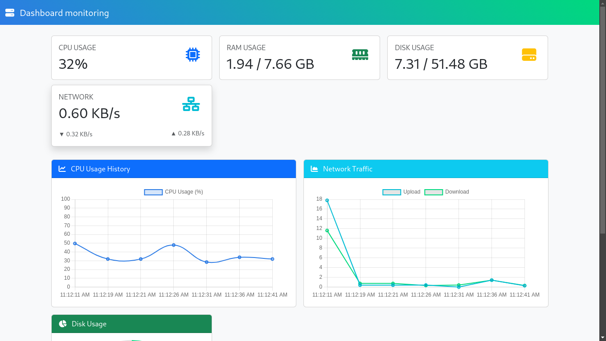
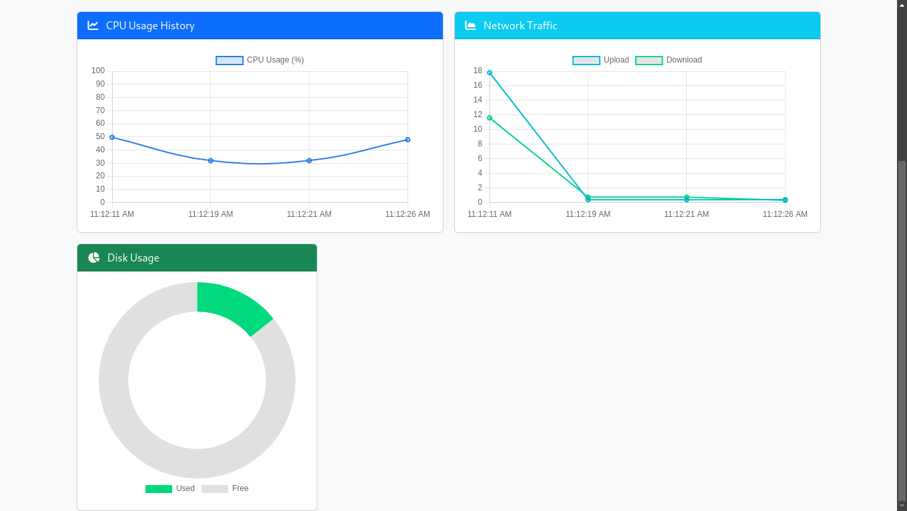

# Dashboard monitoring 🖥️

Sistem pemantauan server real-time untuk memantau penggunaan CPU, RAM, Disk, dan Network menggunakan Flask dan Chart.js.

## Fitur 

- Track CPU usage (%)  
- Monitor RAM consumption (GB)  
- Visualize disk space utilization (GB)  
- Network traffic analysis (upload/download speed in KB/s)  


## Nex Update 🚀

- **Autentikasi Pengguna**  
   Menambahkan login dengan role admin dan viewer.

- **Penyimpanan Historis**  
   Simpan data ke database untuk analisis jangka panjang.

- **Monitoring Proses**  
   Tampilkan daftar proses yang menggunakan resource terbanyak.

- **Sistem Alert**  
   Kirim notifikasi via email/Telegram ketika metrik melebihi batas.


## Backend ⚙️
- **Python 3**  
   Bahasa pemrograman utama untuk logika server dan pengolahan data.

- **Flask**  
   Framework web ringan untuk membuat API dan melayani halaman HTML.

- **psutil**  
   Library Python untuk mengumpulkan data sistem (CPU, RAM, Disk, Network).

- **Threading**  
   Digunakan untuk menjalankan pengumpulan data secara real-time di latar belakang.

---

### Frontend 🎨
- **HTML5/CSS3**  
   Struktur dasar dan styling halaman web.

- **Bootstrap 5**  
   Framework CSS untuk desain responsif dan komponen UI (cards, navbar, grid).

- **Chart.js**  
   Library JavaScript untuk visualisasi data dalam bentuk grafik (line, doughnut, area).

- **Font Awesome**  
   Ikon vektor yang digunakan untuk mempercantik tampilan (misal: ikon server, CPU).

- **JavaScript/ES6**  
   Untuk logika frontend seperti pembaruan data real-time dan interaksi.

## Dependensi Utama
| Nama | Versi | Kegunaan |
|------|-------|----------|
| Flask | 2.3.2 | Web framework backend |
| psutil | 5.9.5 | Pengumpulan data sistem |
| Chart.js | 4.4.0 | Visualisasi grafik |
| Bootstrap | 5.3.0 | Desain responsif |


## Instalasi 
```bash
git clone https://github.com/Aqid191161/Dashboard-monitoring.git
cd Dashboard-monitoring
pip install -r requirements.txt
python3 app.py
```

## otput terminal
```
┌───(kali㉿kali)-[~]
└─$ python3 app.py                  
 * Serving Flask app 'app'
 * Debug mode: off
WARNING: This is a development server. Do not use it in a production deployment. Use a production WSGI server instead.
 * Running on all addresses (0.0.0.0)
 * Running on http://127.0.0.1:5000
 * Running on http://192.168.0.103:5000
Press CTRL+C to quit

```

## Screenshot

|  | |
|---|---|

## 🙌 Credit & Lisensi

## Credit 🙌

- **Teknologi**: Python, Flask, Chart.js, Bootstrap 5, Font Awesome
- **Library Utama**: 
  - `psutil` untuk pengumpulan data sistem
  - `chart.js` untuk visualisasi
- **Sumber Daya**:
  - [Bootstrap Documentation](https://getbootstrap.com/)
  - [Chart.js Documentation](https://www.chartjs.org/)


## 📄 Lisensi
Proyek ini dilisensikan di bawah **MIT License**. Anda bebas menggunakan, mengubah, dan mendistribusikan proyek ini dengan tetap menyertakan atribusi kepada pengembang asli.

Silakan baca file **[LICENSE](LICENSE)** untuk informasi lebih lanjut.# Dashboard-monitoring
